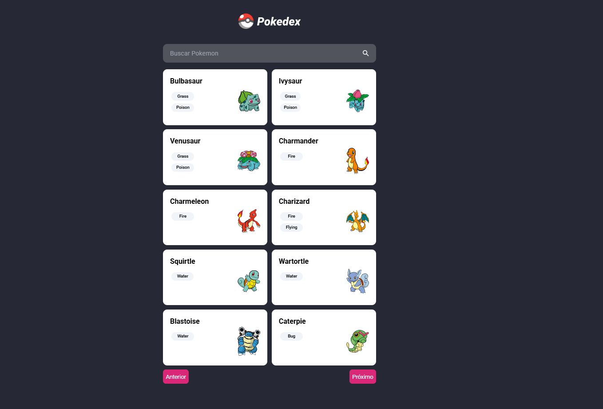
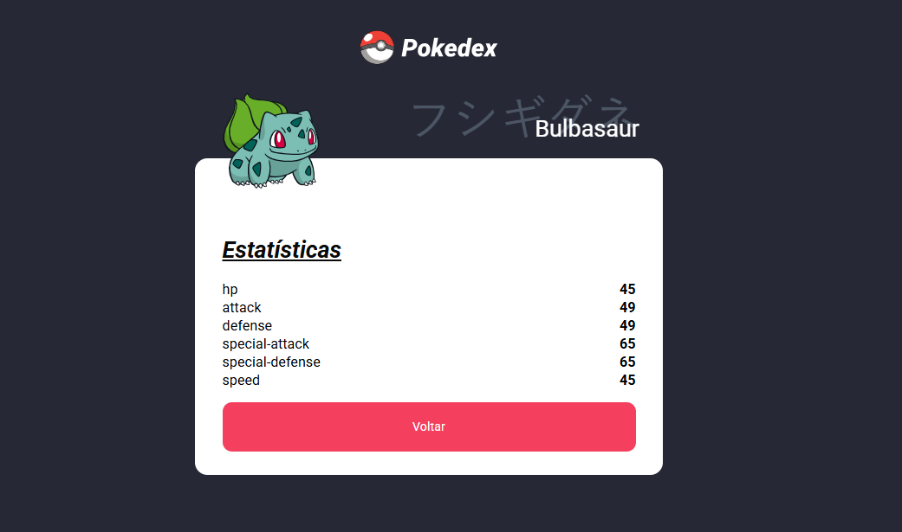

## Features

Design moderno + Animações suaves
Tailwind 3.4.17 + SCSS
Versão do Angular 18.2.0 + Angular PWA

- ✔️ Listar Pokémons: Explore a variedade de Pokémons disponíveis na PokeAPI.
- ✔️ Filtrar Pokémons: Localize os Pokémons que você deseja visualizar.
- ✔️ Visualizar detalhes do Pokémon: Clique em qualquer Pokémon para visualizar mais detalhes em uma outra rota.

<hr>
<h1 align="center">Pokedex - Angular</h1>
</p>

<br>

## 🎯 Sobre

Essa aplicação é uma pokedex construída em Angular, permitindo aos usuários explorar, filtrar por diferentes Pokémons de uma maneira interativa e moderna.

Com a integração da [PokeAPI](https://pokeapi.co/docsv2), a aplicação proporciona uma experiência de navegação agradável e envolvente para os fãs de Pokémon.

<div align="left" id="top"> 
  <a href="https://www.linkedin.com/in/estaciorenandesousarodrigues/">Estácio Renan</a>
</div>

[Link Pokedex](https://pokedex-angular-lime.vercel.app/)

## 👨‍💻 Tecnologias

As seguintes ferramentas foram usadas na construção do projeto:

- [Angular](https://angular.io/)
- [Tailwind](https://v3.tailwindcss.com/)
- [RxJs](https://rxjs.dev/)
- [TypeScript](https://www.typescriptlang.org/)

## 🤠 Características do Projeto

Este projeto foi construído usando vários recursos e práticas recomendadas do Angular, incluindo:

- ✔️ Services: Utiliza Services do Angular para lidar com a lógica de negócios e interações com APIs do pokedex.
- ✔️ Standalone Components: importações direta no componentes, sem o uso dos módulos.

## ✅ Pré requisitos

Antes de começar você precisa ter:

- [Git](https://git-scm.com) e o [Node](https://nodejs.org/en/) instalados em sua máquina.
- [Angular CLI version 18.2.0](https://github.com/angular/angular-cli)

## :checkered_flag: Começando

```bash
## Clone este repositório
$ git clone https://github.com/estaciorenanrodrigues/Pokedex-Angular.git

# Entre na pasta
$ cd Pokedex-Angular-master

# Instale as dependências
$ npm install

Execute `ng serve`
# O app vai inicializar em
<http://localhost:4200/>
```

## 🤠 Screenshot's

<div align="center">
  
  
</div>
